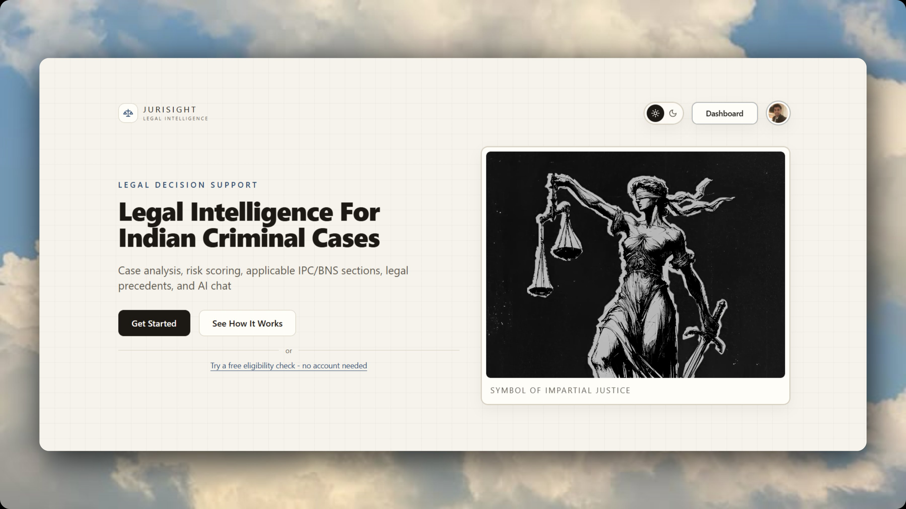

# JuriSight

JuriSight is an AI powered legal analysis platform designed to support criminal case review and legal research workflows. It assists with analyzing FIRs, charge sheets, and case narratives by combining document processing, procedural validation, and contextual AI reasoning.



---

## About

JuriSight streamlines the review of criminal case documents by transforming unstructured legal records into organized analyses. The platform combines document extraction, procedural checks, and conversational AI to help users understand case details, evaluate procedural considerations, and explore legal questions through a single workflow.

It is designed for educational, research, and productivity purposes and is not intended to replace professional legal advice.

---

## Features

- PDF upload and document extraction
- FIR and charge sheet analysis
- Bail eligibility assessment
- Risk scoring and procedural evaluation
- Applicable legal section identification
- Context aware legal conversations
- Persistent case history
- Shareable case summaries

---

## Application Preview


---

## Technology Stack

### Frontend

- Next.js
- React
- TypeScript
- Tailwind CSS
- shadcn/ui
- Framer Motion

### Backend

- Next.js API Routes
- Prisma ORM
- PostgreSQL

### AI & Document Processing

- Groq API
- PDF parsing
- OCR assisted document extraction
- Structured prompting
- Rule based procedural validation

---

## Architecture

```text
User Input
      │
      ▼
Document Extraction
      │
      ▼
Procedural Validation
      │
      ▼
AI Reasoning
      │
      ▼
Risk Assessment
      │
      ▼
Structured Legal Analysis
```

---

## Disclaimer

JuriSight is an AI assisted legal analysis platform intended for educational, research, and productivity purposes.

It does not provide legal advice and should not be relied upon as a substitute for professional legal counsel. All outputs should be reviewed by a qualified legal professional.

---

## License

Copyright © 2026 Yash Kaushik.

All Rights Reserved.
